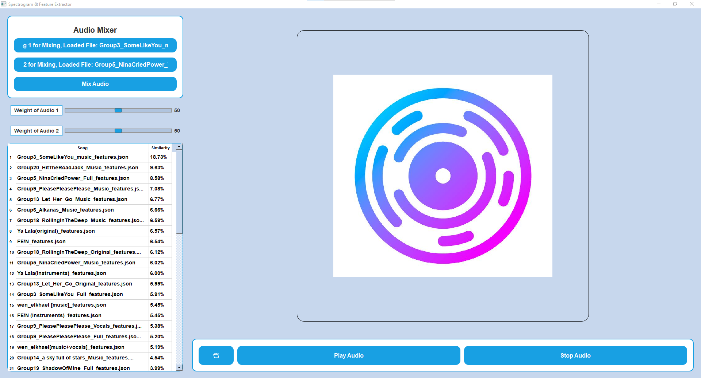

# TuneSpy



TuneSpy is a Python application that allows users to load audio files, generate spectrograms, extract MFCC features, and compare the loaded audio with a preprocessed database of songs to find the most similar match.


## Features

- Load audio files in various formats (MP3, WAV, FLAC)
- Generate spectrograms and save them as PNG images
- Extract MFCC features and save them as JSON files
- Hash spectrogram images using perceptual hashing
- Compare loaded audio with a preprocessed database of songs
- Display the most similar songs with similarity percentages
- Mix two audio files with adjustable weights
- Play and stop audio playback

## Requirements

- Python 3.x
- Required Python packages (install using `pip`):
  - `librosa`
  - `numpy`
  - `matplotlib`
  - `imagehash`
  - `Pillow`
  - `PyQt5`
  - `soundfile`
  - `sounddevice`
  - `scipy`
  - `mutagen`

## Installation

1. Clone the repository:
   ```sh
   git clone https://github.com/HarmoniCode/TuneSpy.git
   cd TuneSpy
   ```

2. Install the required Python packages:
   ```sh
   pip install -r requirements.txt
   ```

## Running the Application

```sh
python main.py
```

## License

This project is licensed under the MIT License. See the LICENSE file for details.